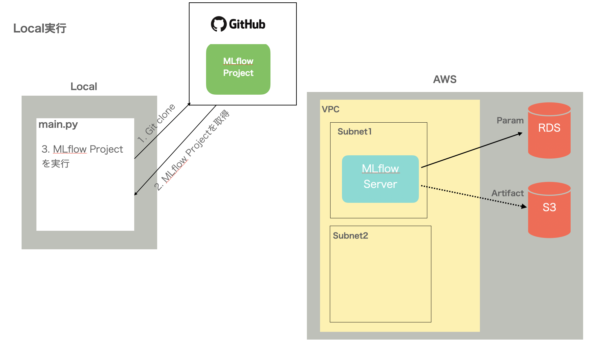
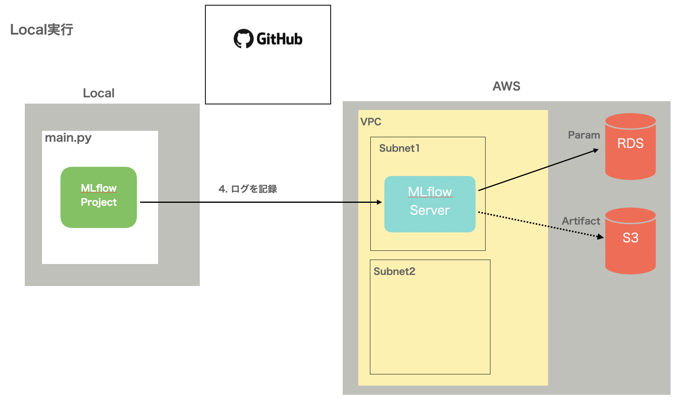
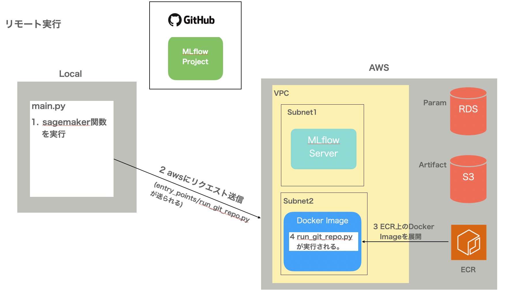
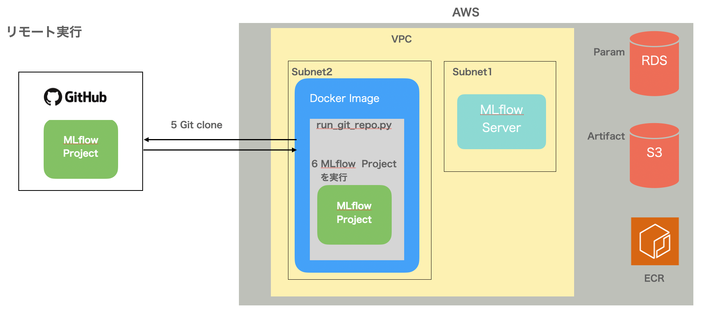
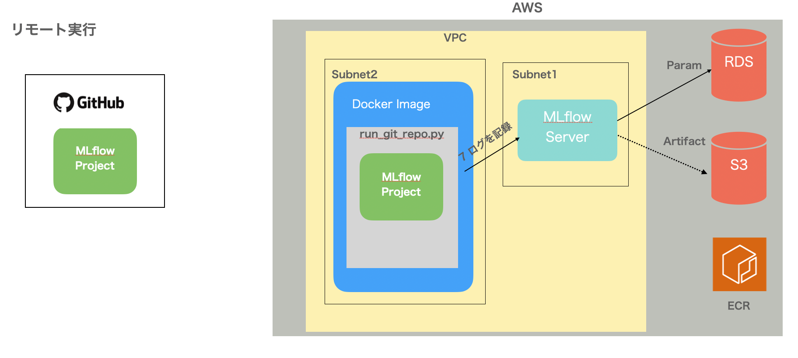
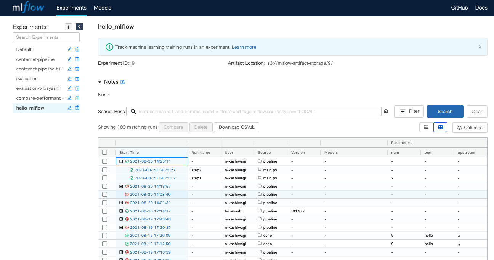

## 概要

MLflowを利用したパイプラインのサンプルです。

## 全体像

### Local実行の場合

**1. ローカル環境でpipeline/main.pyを実行します。**

**2. pipeline/main.pyがgit上のレポジトリにあるMLflow Projectをクローンします。**


**3. ローカル環境でMLflow Projectが実行されます。**


MLflow Projectの中でログを記録すると、MLflowサーバを経由し、パラメータやメトリクスは、RDSへ、アーティファクト(注1)は、S3に保存されます。

**注1:** アーティファクトとは、実験の成果物こと。mlflow.log_artifact(local_path)のように実行すると、該当パスのファイルがアーティファクトストレージ(S3)に保存されます。

### Sagemaker上で実行する場合

**1. ローカル環境でpipeline/main.pyを実行します。**

**2. sagemakerがaws上でイメージを展開し、エントリーポイント(注2)が実行されます。**


aws上にECRから取得したDockerイメージが展開され、その中でエントリーポイント(entry_points/run_git_repo.py) が実行されます。

**3. コンテナ内でgithubから取得したMLflow Projectが実行されます。**


**4. MLflow Projectがログを記録します。**


**注2:** エントリーポイントとは、Dockerコンテナを実行した際に実行されるファイルやコマンドのことです。sagemaker.pytorch.estimator.PyTorch によりsagemakerを起動した場合は、引数に指定したローカルのpythonスクリプトが送信され、aws上に展開されたコンテナ内で実行されます。

## 実験結果の閲覧



https://mlflow.safie-dev.link/#/ から、実験結果のログが見られます。(VPNが必要)


## ディレクトリ構成

**custom_images**
AWSで処理を行う場合にパイプライン内のSagemakerが利用するdockerイメージのサンプルです。Sagemaker[公式のPytorchイメージ](https://github.com/aws/deep-learning-containers/blob/master/available_images.md)を拡張して作る必要があります(注3)。イメージにも、mlflow, GitPythonをインストールする必要があります。ローカルで処理する場合は利用しません。

**pipeline**
Mlflowを利用したパイプラインのサンプルです。複数のMLflowプロジェクトを連結し、実行しています。
※Sagemakerのパイプライン機能は使っていません。

**sample_projects**
Mlflow プロジェクトのサンプルです。
- echo
文字を書き込んだファイルを保存します。
- zip
入力したファイルをzip化して保存します。

**注3:** [sagemaker.pytorch.estimator.PyTorch](https://sagemaker.readthedocs.io/en/stable/frameworks/pytorch/sagemaker.pytorch.html) を利用しているため、この関数に対応した公式イメージをベースにイメージを作成する必要があります。[sagemaker.estimator.Estimator](https://sagemaker.readthedocs.io/en/stable/api/training/estimators.html)を利用した場合、任意のDockerイメージを指定することができます。


## 環境構築

```bash
# docker, docker-composeをインストール

# pythonをインストール (※ 3.7.8で試しています。)

# python ライブラリを入れる
pip install mlflow
pip install GitPython
pip install sagemaker

# 家から実行する場合は、VPN接続する。

# AWSのmfa認証を行う

# gitのid, parsonal tokenを環境変数に登録
export GIT_ID="XXXX"
export GIT_TOKEN="XXXX"
export AWS_ACCESS_KEY_ID="XXXX"
export AWS_SECRET_ACCESS_KEY="XXXX"

# ベースイメージをプル
cd custom_images/SafiePytorch/1.5.1-cpu-py36-ubuntu16.04
bash pull_base_image.sh
# ビルド
bash build.sh
# プッシュ（イメージに変更がある場合に実行する。）
bash push.sh
```

※ パイプラインの要素をコンテナ上で実行する場合があるので、docker上のpython環境ではなく、pyenvやcondaなどの仮想環境上で実行するようにしてください。

## 実行

**パイプラインを実行**
```bash
cd pipeline
MLFLOW_EXPERIMENT_NAME=hello_mlflow \
MLFLOW_TRACKING_URI=http://localhost:5000/ \
MLFLOW_S3_ENDPOINT_URL=http://localhost:9000/ \
AWS_PROFILE=minio \
mlflow run . --no-conda
```

**各プロジェクトを単体で実行**
```bash
cd sample_projects/echo
MLFLOW_EXPERIMENT_NAME=hello_mlflow \
AWS_PROFILE=minio \
MLFLOW_TRACKING_URI=http://localhost:5000/ \
MLFLOW_S3_ENDPOINT_URL=http://localhost:9000/ \
mlflow run . --no-conda \
-P text="hello" \
-P num=9
```